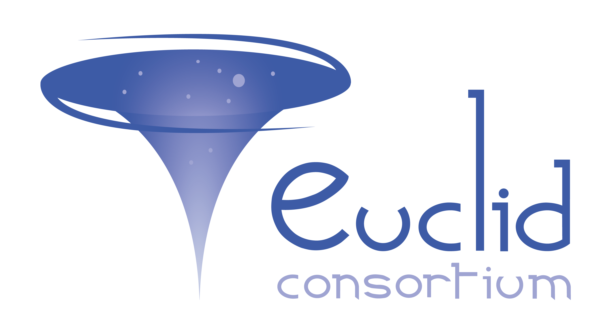
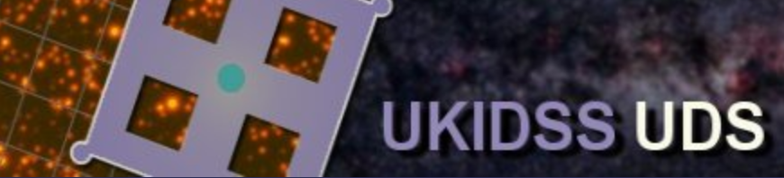
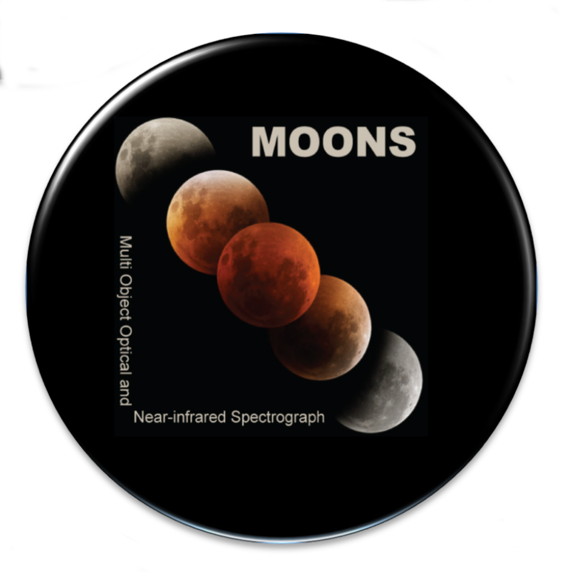
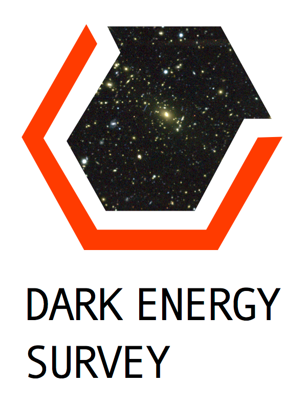
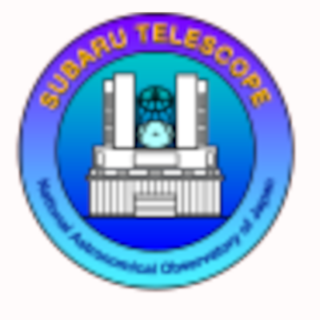

---
# Feel free to add content and custom Front Matter to this file.
# To modify the layout, see https://jekyllrb.com/docs/themes/#overriding-theme-defaults

layout: default
title: Will Hartley
---

# About me

I am Adjoint scientifique at unige

CV link

Pub link (ORCID)

# Projects

<table>
    <tr>
        <td colspan="2" style="width:25%"></td>
        <td colspan="2" style="width:25%"></td>
    </tr>
    <tr>
        <td style="width:25%"></td>
        <td style="width:25%"></td>
        <td style="width:25%"></td>
        <td style="width:25%"></td>
    </tr>
</table>

 
 
Follow [this link](Misc) for a collection of other projects I've been involved in

 

# Blog
